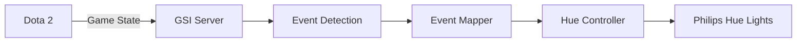

# Dota 2 → Philips Hue GSI Integration

[](https://choosealicense.com/licenses/mit/)
[](https://nodejs.org/)
[](https://www.typescriptlang.org/)
[](https://developer.valvesoftware.com/wiki/Dota_2_Workshop_Tools/Game_State_Integration)
[](https://developers.meethue.com/)
[](CONTRIBUTING.md)

Sync Philips Hue lights with Dota 2 matches. Pulses red on kills, rainbow on rampages, fades on death.
## Features

### Dynamic Light Effects
- **Kills** - Red pulse for each enemy elimination
- **Killing Sprees** - Intense red flashing for domination (3+ kills)
- **Rampage** - Rainbow celebration for legendary streaks (5+ kills)
- **Death** - Lights fade to darkness during respawn
- **Respawn** - Bright white flash when returning to battle
- **Ultimate** - Epic purple pulse when casting ultimate abilities
- **Low Health** - Urgent red breathing effect when health drops below 20%
- **Victory/Defeat** - Rainbow celebration or blue fade at game end

## Prerequisites

- **Dota 2** (Steam)
- **Philips Hue Bridge** and compatible smart lights
- **Node.js 16+** or **Bun** runtime
- Local network connection

## Quick Start

### 1. Clone and Install

```bash
git clone https://github.com/greenb1rd/dota2-hue-gsi.git
cd dota2-hue-gsi
npm install
```

### 2. Configure Hue Bridge

Create a `.env` file in the project root:

```env
GSI_PORT=3000
HUE_BRIDGE_IP=192.168.1.100      # Your Hue Bridge IP
HUE_USERNAME=your-hue-username    # Generated from Hue API
HUE_LIGHT_IDS=1,2,5               # Optional: specific light IDs
```

**Finding your Hue Bridge IP:**
1. Open the Philips Hue app
2. Settings → Hue Bridges → (i) icon
3. Note the IP address

**Getting a Hue username:**
1. Visit `http://<bridge-ip>/debug/clip.html`
2. Press the physical button on your Hue Bridge
3. Send a POST to `/api` with body: `{"devicetype":"dota2-hue-gsi"}`
4. Copy the generated username

### 3. Configure Dota 2

Copy the GSI configuration file to your Dota 2 directory:

**Windows:**
```bash
copy gamestate_integration_hue.cfg "C:\Program Files (x86)\Steam\steamapps\common\dota 2 beta\game\dota\cfg\"
```

**macOS:**
```bash
cp gamestate_integration_hue.cfg ~/Library/Application\ Support/Steam/steamapps/common/dota\ 2\ beta/game/dota/cfg/
```

**Linux:**
```bash
cp gamestate_integration_hue.cfg ~/.steam/steam/steamapps/common/dota\ 2\ beta/game/dota/cfg/
```

### 4. Start the Integration

```bash
npm start
```

Launch Dota 2

## Development

```bash
# Development mode with hot reload
npm run dev

# Build TypeScript
npm run build

# Type checking
npm run lint
```

## Architecture



## Configuration Options

| Environment Variable | Description | Default |
|---------------------|-------------|---------|
| `GSI_PORT` | Port for GSI server | 3000 |
| `HUE_BRIDGE_IP` | Philips Hue Bridge IP address | Required |
| `HUE_USERNAME` | Hue API authentication token | Required |
| `HUE_LIGHT_IDS` | Comma-separated light IDs | All lights |

## Troubleshooting

### Lights not responding
- Verify Hue Bridge IP and username in `.env`
- Ensure lights are powered on and connected
- Check firewall settings for port 3000

### No game data received
- Confirm GSI config file is in the correct Dota 2 directory
- Restart Dota 2 after adding the config
- Check Windows Firewall or antivirus blocking

### Connection errors
- Verify you're on the same network as Hue Bridge
- Test Hue API access: `http://<bridge-ip>/api/<username>/lights`

